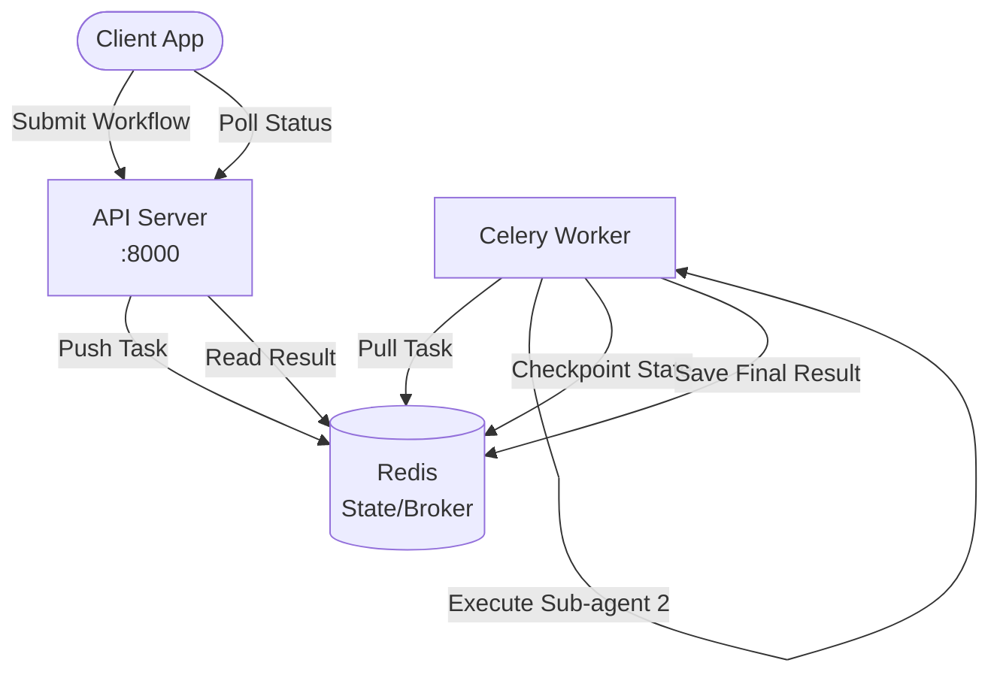

# Architecture — agent-orchestration-system
> Last updated: 2026-08-29 | Maturity: Partial Prototype
> _Durable execution of multi-agent workflows._

## System Diagram

## Component Table
| Component | File | Responsibility | Tech |
|---|---|---|---|
| API Server | `server/main.py` | Receives workflows, polls status | FastAPI |
| Celery Worker | `server/worker.py` | Executes agent steps | Celery |
| Broker/Backend | `docker-compose.yml` | Message broker and result backend | Redis |

## Dependency Honesty Table
| Dependency | Status | Notes |
|---|---|---|
| Redis | **Real** | Used for both Celery message broker and durable state checkpoints. |
| Sub-Agents | **Mocked** | Sleep-and-return logic used to simulate long-running LLM calls. |
